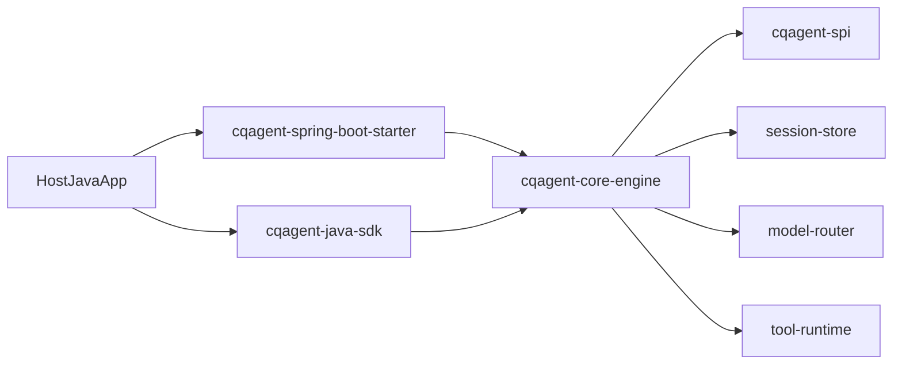

# 统一智能体 Jar 产品 - 架构设计

## 1. 产品定位

本项目定位为可嵌入其他 Java 项目的智能体能力包，提供：

- `cqagent-java-sdk`：纯 Java SDK
- `cqagent-spring-boot-starter`：Spring Boot 自动装配
- `cqagent-core-engine`：内嵌执行内核（LangChain4j 运行时）
- `cqagent-spi`：模型、工具、会话扩展点

不再以独立微服务平台作为唯一主形态。

## 2. 总体架构

## 3. 模块职责

- `cqagent-spi`
  - `ProductModelProvider`
  - `ProductTool`
  - `ProductSessionStore`
- `cqagent-core-engine`
  - 会话管理与 LangChain4j 适配
  - 逻辑模型路由（含主备/加权/健康感知）
  - 工具执行与多轮回路
- `cqagent-java-sdk`
  - `AgentClient` + `AgentClientBuilder`
  - 默认注册常用 `ProductModelProvider`
- `cqagent-spring-boot-starter`
  - `agent.product.*` 配置绑定
  - `AgentClient` 自动注入

## 4. 关键原则

- 内嵌优先：业务进程内直接调用，降低部署复杂度
- 契约复用：复用 `agent-api` 与 `model-api`
- 开放封闭：通过 SPI 扩展厂商与工具，不随意修改核心类
- 可演进：Starter 与 SDK 对外行为保持一致

## 相关文档

- [技术栈评估](02-tech-stack-evaluation.md)
- [任务拆解与阶段](03-task-breakdown.md)
- [核心能力基线](docs/product/core-capabilities.md)
